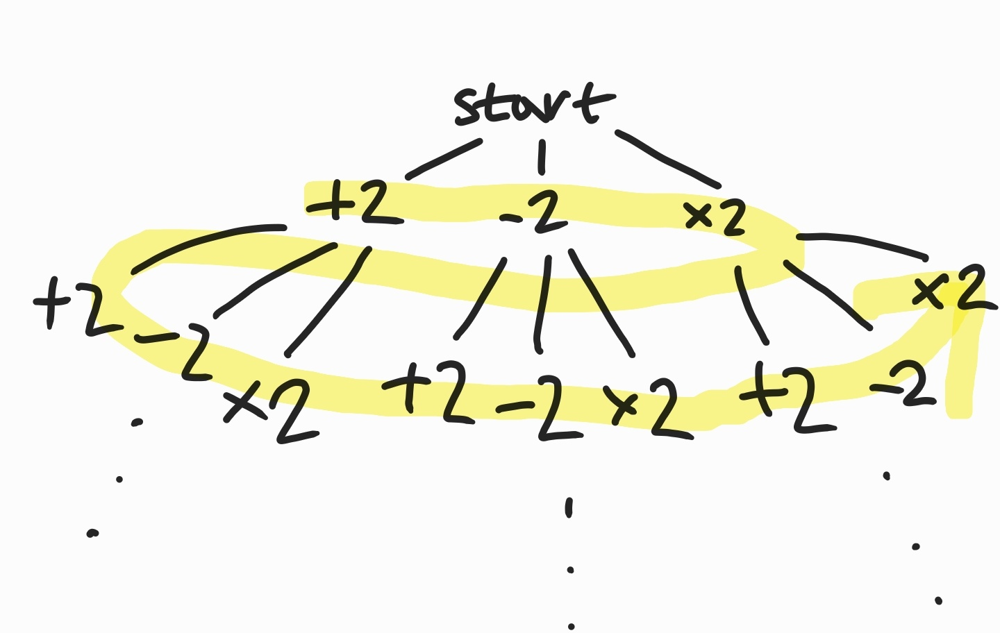
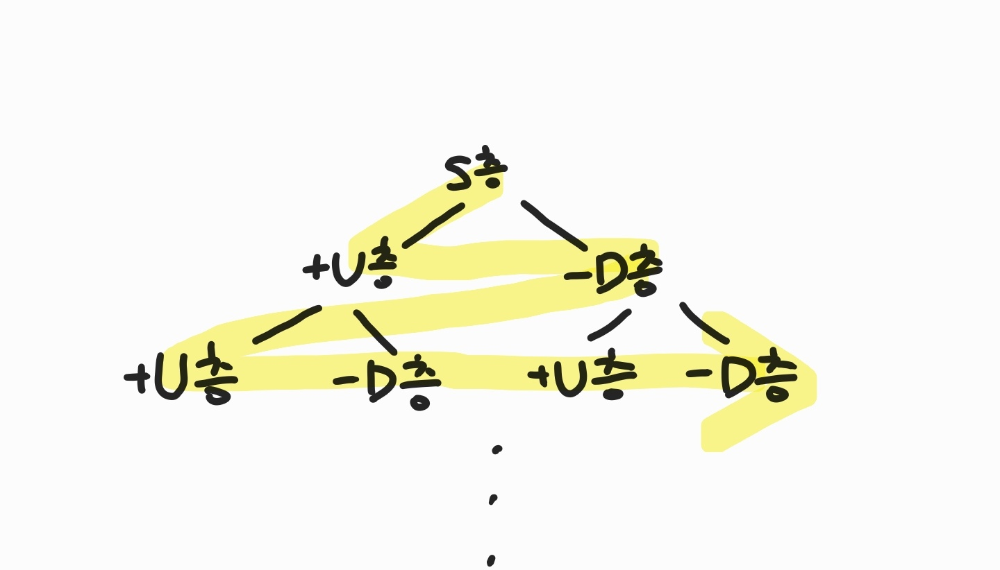

# 03/31 알고리즘

> BOJ1697, BOJ5014

<br>

<br>

## 1. BOJ1697

> 문제링크: https://www.acmicpc.net/problem/1697

<br>

### 나의 코드

```python
from collections import deque

def bfs(s, time):
    q = deque()
    q.append((s, time))

    while q:
        ns, t = q.popleft()

        # 동생이 있는 곳일 경우 return
        if ns == k:
            return t

        # 인덱스가 넘어갈 경우
        if ns < 0 or ns > 100000:
            continue

        if not visited[ns]:
            visited[ns] = 1
            q.append((ns-1, t+1))
            q.append((ns+1, t+1))
            q.append((ns*2, t+1))

n, k = map(int, input().split())

visited = [0] * 100001  # 방문체크

result = bfs(n, 0)  # bfs

print(result)   # 출력
```

<br>

### 입력

```bash
5 17
```

### 출력

```bash
4
```

<br>

### 풀이

- 아래처럼 BFS를 이용하여 3개씩 가지를 계속 치는 방식으로 문제를 풀었다.

  

- 처음에 방문체크를 따로 안만들어줬더니, 방문했던 곳까지 다시 가서 q에 append 하는 바람에 메모리 초과가 나왔다. 방문했던 곳을 또 다시 가는 것은 최솟값이 아니므로 visited를 만들어서 방문하지 않았던 곳만 가게 했다.
- 현재 위치가 0보다 작거나, n의 최대 범위인 100,000보다 클 경우를 제거해줘야 런타임에러(IndexError)가 나지 않는다.

---

<br>

<br>

## 2. BOJ5014 스타트링크

> 문제링크: https://www.acmicpc.net/problem/5014

<br>

### 나의 코드

```python
from collections import deque

def check(x):
    if x > 0 and x <= f:
        return True
    else:
        return False

def bfs(start, cnt):
    global ans
    q = deque()
    q.append((start, cnt))

    while q:
        p, c = q.popleft()
        
        # g층에 도달한 경우 값 업데이트 후 return
        if p == g:
            ans = c
            return
        
        c += 1  # 버튼 누른 횟수 +1

        # 인덱스가 넘어가지 않고 방문한 적이 없는 층이라면
        if check(p) and not visited[p]:
            visited[p] = 1      # 방문체크
            q.append((p+u, c))  # 위로 u층만큼 이동
            q.append((p-d, c))  # 아래로 d층만큼 이동

f, s, g, u, d = map(int, input().split())

visited = [0] * (f+1)
ans = 1000000000

bfs(s, 0)

# 결과 출력
if ans == 1000000000:   # G층에 갈 수 없을 경우
    print('use the stairs')
else:
    print(ans)
```

<br>

### 입력1

```bash
10 1 10 2 1
```

### 출력1

```python
6
```

<br>

### 입력2

```bash
100 2 1 1 0
```

### 출력2

```python
use the stairs
```

<br>

### 풀이

- 아래처럼 시작층(S층)에서 +U층, -D층 2개로 가지가 계속 뻗어나가는 그래프이다. BFS로 탐색하며 G층에 도달할 경우를 체크한다.

  

- visited를 만들어 방문체크를 하고, 방문한적이 없는 곳만 q에 넣도록 한다.

- G층에 도달하지 못한 경우 ans가 업데이트 되지 않은 것이므로 이를 체크하여 'use the stairs'를 출력한다.