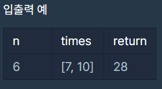

# 05/08 알고리즘

> Programmers 입국심사

<br>

## Programmers 입국심사

문제링크: https://programmers.co.kr/learn/courses/30/lessons/43238

<br>

### 나의 코드

```python
def solution(n, times):
    answer = 0
    
    left = 1
    right = max(times) * n   # 가장 오래 걸릴 경우
    
    while left <= right:
        mid = (left + right) // 2
        cnt = 0
        
        for i in times:
            cnt += mid // i # 심사위원당 심사할 수 있는 사람 수
            
            if cnt >= n:    # n보다 많은 사람을 심사할 수 있을 경우 반복문 벗어남
                break
                
        # 기다리는 사람보다 많은 사람을 심사할 수 있을 경우
        # 한 심사위원에게 주어진 시간을 줄인다.
        if cnt >= n:     
            answer = mid
            right = mid - 1
        
        # 모든 사람을 심사할 수 없는 경우 
        # 한 심사위원에게 주어진 시간을 늘린다.
        elif cnt < n:
            left = mid + 1
            
    return answer
```

<br>

### 입출력



<br>

### 풀이

- 이분탐색을 이용하여 푼다.
- 한 심사위원에게 주어진 시간을 이분탐색 대상으로 놓고, 심사를 마친 사람 수가 n명 이상인지 미만인지로 이분탐색 기준을 나눈다.