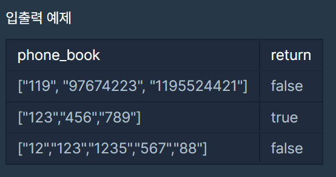
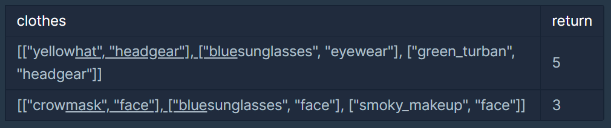

# 06/05 알고리즘

> Programmers 전화번호목록, Programmers위장

<br>

## 1. Programmers 전화번호 목록

> 문제링크: https://programmers.co.kr/learn/courses/30/lessons/42577?language=python3

<br>

### 나의 코드

```python
def solution(phone_book):
    answer = True
    book_len = len(phone_book)
    
    # 시작하는 문자열순으로 정렬 -> 접두사만 보면 되므로 앞뒤로 체크해주면 됨
    phone_book.sort()
    
    for i in range(book_len-1):
        curr_len = len(phone_book[i])
        if phone_book[i] == phone_book[i+1][:curr_len]:
            answer = False
            return answer
                    
    return answer
```

<br>

### 입출력



<br>

### 풀이

- phone_book을 정렬하고 시작하는게 포인트이다.
- phone_book.sort()을 하면 문자열 길이순으로 정렬되는 것이 아니라 시작하는 문자열 순서대로 정렬이 되므로, 접두어를 확인하면 되니까 앞뒤로만 확인해주면 된다.
- 정렬 예: ["119", "97674223", "1195524421"] → ["119", "1195524421", "97674223"]

---

<br>

<br>

## 2. Programmers 위장

> 문제링크: https://programmers.co.kr/learn/courses/30/lessons/42578?language=python3

<br>

### 나의 코드

```python
def solution(clothes):
    answer = 1
    clothes_type = {}
    
    for c in clothes:
        if c[1] in clothes_type:
            clothes_type[c[1]] += 1
        else:
            clothes_type[c[1]] = 2

    
    for i in clothes_type.values():
        answer *= i
    
    return answer-1
```

<br>

### 입출력



<br>

### 풀이

- 의상의 종류별 개수를 카운트 한 후 그 카운트 한 값끼리 곱한다.
- 카운트 할 때 그 종류의 옷을 안입는 경우를 포함시켜야하므로 초기값을 2로 한다.
- 모든 종류의 옷을 입지 않는 경우를 빼야하므로 마지막에 -1을 해준다.

