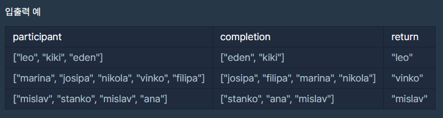

# 06/18 Programmers 완주하지 못한 선수

> Programmers 완주하지 못한 선수

<br>

<br>

## Programmers 완주하지 못한 선수

> 문제링크: https://programmers.co.kr/learn/courses/30/lessons/42576?language=python3

<br>

### 나의 코드

```python
def solution(participant, completion):
    answer = ''
    
    hash = {}
    comp = {}
    
    # key에 참여 선수, value에 0
    for p in participant:
        hash[p] = 0
    
    # 참여 선수 이름별 카운트
    for p in participant:
        hash[p] += 1
    
    # 완주 선수 이름별 -1
    for c in completion:
        hash[c] -= 1
        
    # hash에서 0이 아닌 선수 이름 answer에 넣기
    for h in hash:
        if hash[h] != 0:
            answer = h
            break
            
    return answer
```

<br>

### 입출력



<br>

### 풀이

- 해쉬를 이용하여 풀이했다.
  1. 참여 선수 이름을 key로, 0을 value로 세팅한다.
  2. 동명 이인이 있을 수 있으므로 참여선수의 이름별로 +1씩 카운트한다.
  3. 완주 선수 이름 개수별로 -1한다.
  4. 결과 딕셔너리에서 0이 아닌 선수를 출력한다.