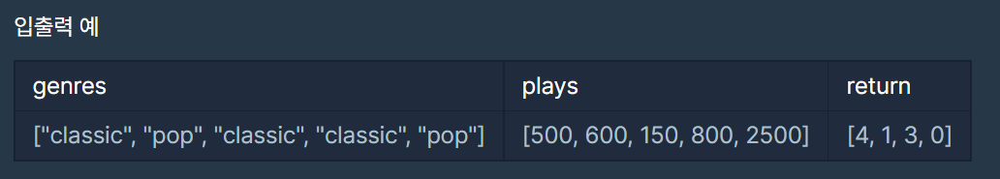

# 06/19 알고리즘

> Programmers베스트앨범

<br>

<br>

## Programmers 베스트앨범

> 문제링크: https://programmers.co.kr/learn/courses/30/lessons/42579

<br>

### 내코드

```python
def solution(genres, plays):
    answer = []
    hash = {}   # 장르별 총 재생 횟수를 담기위한 딕셔너리
    info = [[] for _ in range(len(genres))]     # 노래별 [장르, 재생횟수, 고유번호] 를 담기 위한 리스트
    
    # 장르별 총 횟수를 체크하고 노래별 정보를 담기
    for g in range(len(genres)):
        info[g] = ([genres[g], plays[g], g])
        if genres[g] in hash:
            hash[genres[g]] += plays[g]
        else:
            hash[genres[g]] = plays[g]
            
    # 장르별 총 재생 횟수가 큰 순서로 정렬
    hash_sort = sorted(hash.items(), key=lambda x:x[1], reverse=True)
    # 노래별 1.재생횟수 2.고유번호 순서의 기준으로 정렬
    info_sort = sorted(info, key=lambda x: (x[0], -x[1], x[2]))
    
    # 장르별 총 재생 횟수가 큰 순서대로, 장르별 2곡씩만 고유번호 담기
    for h in hash_sort:
        tmp = 0     # 장르별 2개씩만 담기 위한 변수
        for i in info_sort:
            if h[0] == i[0] and tmp < 2:
                answer.append(i[2])
                tmp += 1
                
    return answer  
```

<br>

### 입출력



<br>

### 풀이

- 장르별 총 재생 횟수를 체크하고 각 노래별로 [장르, 재생횟수, 고유번호]를 따로 리스트에 저장한다.
- 장르별 총 재생 횟수와 노래별 리스트를 정렬하고 노래 수록 기준에 따라 answer에 고유번호를 각 장르별 2개만 append하였다.